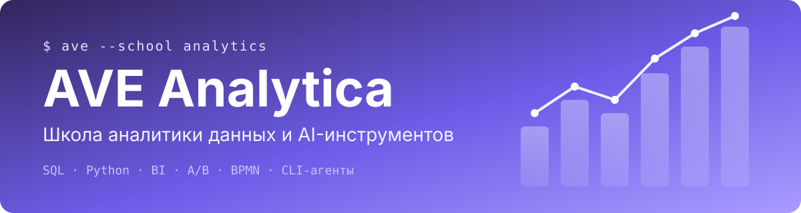

<div align="center">



<br>

[](https://ave-analytica.tech)
[](https://cli.ave-analytica.tech)

**Онлайн-школа для тех, кто начинает с нуля, уже работает с данными или связывает бизнес и IT.**
Пять отдельных курсов — выбираете конкретный навык и сразу идёте в практику.

</div>

---

## 🧭 Направления

| | Курс | Для кого | Что освоите | Формат |
|:-:|---|---|---|---|
| 🧱 | **База аналитика** | старт без опыта | логика работы с данными, SQL, Python, 4 проектные работы | 2 месяца · 4 модуля |
| 📊 | **BI-аналитика** | аналитикам, которым нужны дашборды | EDA в Python, метрики под задачи бизнеса, дашборд в Superset | 1 месяц · 2 модуля |
| 🧪 | **Статистика и A/B-тесты** | аналитикам и продуктовым специалистам | гипотезы и метрики, статистика, дизайн и разбор экспериментов | 1 месяц · 3 модуля |
| 🧩 | **Бизнес-аналитик** | специалистам между бизнесом и IT | требования, AS-IS / TO-BE, BPMN, User Stories и Agile | 1 месяц · 2 модуля |
| 🤖 | **AI-агенты в аналитике** | тем, кто работает с данными | CLI-агенты, MCP, агенты в SQL/Python/отчётности, мультиагентный мини-проект | 2 недели · 3 модуля |

> 🟢 Сейчас открыт набор на **«AI-агенты в аналитике»** — программа на [cli.ave-analytica.tech](https://cli.ave-analytica.tech).

## 🎓 Как мы учим

- **Преподаватели-практики** — каждое направление ведёт специалист из соответствующей профессии (VK, Яндекс, Microsoft, Ozon, СберЗвук, 2ГИС).
- **Отдельные программы** — база, BI, A/B, бизнес-анализ и AI не смешаны в одну «солянку».
- **Теория + практика вместе** — онлайн-вебинары и воркшопы, задания и итоговый проект по направлению.
- **Свой темп** — материалы в цифровом формате, ориентир по срокам указан в программе курса.
- **Выбор до заявки** — сначала сравниваете программы, потом оставляете интерес.

```text
ave_school=# SELECT direction, status FROM courses ORDER BY audience;

 direction          | status
--------------------+----------------
 База аналитика     | лист ожидания
 BI-аналитика       | лист ожидания
 A/B-тесты          | лист ожидания
 Бизнес-аналитика   | лист ожидания
 AI-агенты          | открыт набор
(5 rows)
```

## 🌐 Сайты

| | |
|---|---|
| 🏫 Школа | [ave-analytica.tech](https://ave-analytica.tech) |
| 🤖 Курс «AI-агенты в аналитике» | [cli.ave-analytica.tech](https://cli.ave-analytica.tech) |

<div align="center">

<sub>Учитесь думать как аналитик: не просто писать код, а понимать, зачем вы это делаете.</sub>

</div>
